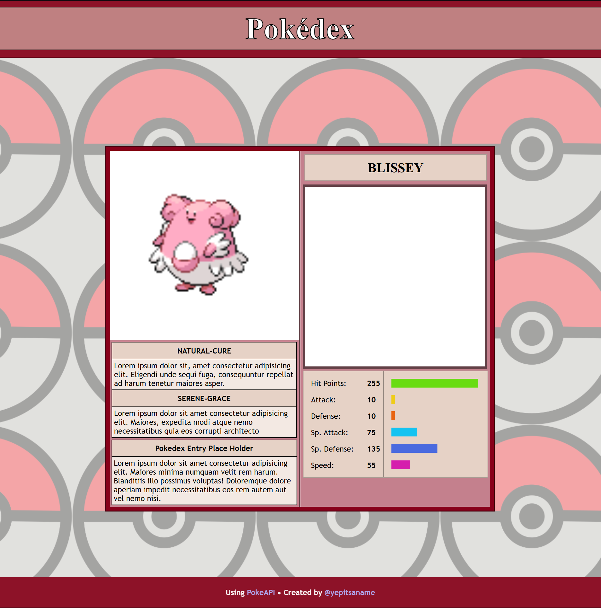

# PokeCard Webpage
This webpage is designed to show an end user the PokeDex data for any pokemon using Generation III stats and beyond. It will not show their move pool or learnsets.

## Basic Design

## Current State

## Functions of the Page
1. Allows users to cycle through the PokeDex
2. Allows users to search for a specific pokemon
3. Handles a pokemon not found exception
4. Defaults to the first PokeDex entry if no key is provided
5. Seperates pages using a pokemon_id?=key pair
6. Caches pokedata in the storage to prevent repeat calls

## Basic Page Interaction
1. Search bar to go to a specific pokemon
2. Left and right buttons to cycle through pokemon
3. PokeDex Entry left and right buttons to cycle through different game pokedex entries
4. Allow users to toggle between male/female sprites
5. Allow users to toggle shiny/normal sprites

## Base Display / Data Manipulation
1. Should fetch a pokemon from the PokeApi
2. Should display the front image non-shiny male/neutral image by default
3. Should display the pokemon's name
4. Should display their abilities
5. Should display the earliest generation pokedex entry and what gen/game it is from
6. Should display a pokemon's base stats as a graph
7. Should display a pokemon's base stats as labeled values
8. Should display the image of the previous pokemon or next pokemon by the outer left/right buttons
9. Should not display any image and grey out left/right buttons if there is no more pokemon

## Page JS Life Cycle
* ### User Navigated to Page
1. Check the url for a pokemon id/key pair
   1. If the url has a id/key pair continue pass it into the next step
   2. Else set the id/key pair to 1 (Bulbasaur) and pass that into the next step
2. Check if the current (id/key pair), previous, and/or next ID are cached
   1. Fetch the current, previous, and/or next ID
   2. Cache the response with a key pair in local storage
3. Load the previous and next pokemon images if found
4. Load the current pokemon images (front male/female, shiny front male/female) into the entry
5. Load the pokemon name
6. Load the pokemon abilities
7. Load the pokemon stats
8. Find the most recent pokedex text and show it
9. Calculate stat points and draw lines between them on a canvas
10. Grey out/disable left/right buttons if there is no next/previous pokemon/pokedex entry
* ### User Clicked Next/Previous PokeDex Entry Button
1. Navigate to the next/previous pokedex entry page with the next/previous pokemon id
2. Go into **User Navigate to Page**

## Implementations

- [X] Fetches pokemon data from the PokeAPI
   - Required to present pokemon data to the user
- [X] Fetches pokemon data based on a URL parameter
   - Allows for previous and next pokemon operations
   - Allows for a pokemon to be loaded on page load
   - Allows the page to be "static" on load
- [x] Sets default pokemon to key 1 if no key provided
- [ ] Fetches pokemon data based on a user search request
   - Allows for a bypass of the normal "search" request
- [X] Caches pokemon data in the local storage
   - Keeps from making repeated API calls
- [x] Caches a id pokemon name in the local storage
   - Keeps from making repeated API calls since calls are by by ID
- [x] Gets Pokemon name and displays it
- [x] Gets Pokemon ability data and displays it
   - [x] Fetch ability information
- [x] Gets Pokemon image data and displays it
- [ ] Gets Pokemon Pokedex data based on most recent generation
   - [ ] Fetch pokedex information
- [x] Gets Pokemon stats and displays them
   - - [x] Text
   - - [x] Bar graph
      - - [x] Set width of a div equal to 255 / pokemon stat * 90 (max width of div)
   - - [ ] Chart
      - - [ ] Uses a canvas to draw lines and points
      - - [ ] Has math to determine points on a graph for each stat
      - - [ ] Stroke outer and inner graph shapes
      - - [ ] Stroke a shape from the points
      - - [ ] Fill in the shape with a color

## Identified Problems Not Previously Considered
- [x] A pokemon fetch does not pull the descriptions of abilities
- [ ] A pokemon fetch does not pull the pokedex entry description
- [ ] Look into Morepeko / multiform
- [ ] Look into pokemon with more than two abilities
- [ ] May need to re-add RegExp( /^(?!\s$)[A-Za-zÉé0-9\/ ,-.×]+$/gm )

## Other Things to Consider for User Experience
- [ ] A default loading page
   - [ ] Checks if pokemon is loaded in storage
   - [ ] Performs pokemon fetch request
   - [ ] Performs ability fetch requests
   - [ ] Performs pokedex entry fetch request
   - [ ] Saves data into memory
   - [ ] Puts data on screen
   - [ ] Hides loading elements

## Stretch Goals
- [ ] Display the encounter route/routes
- [ ] Allow for the user to see shiny/female variants of the images
- [ ] Navigates to the last user page visit on refresh with no parameter
   - Possibly useful - goal for later
- [ ] User Clicked Next/Previous PokeDex description
